```mermaid
graph LR
    A[Web Security] --> B[Advanced VAPT]
    B --> C[Cloud Security]
    C --> D[Red Team Operations]
    D --> E[Security Architecture]
    E --> F[Threat Intelligence]
    F --> G[Zero-Day Research]
    
    style A fill:#00FF41,stroke:#00FF41,stroke-width:2px
    style B fill:#00FF41,stroke:#00FF41,stroke-width:2px
    style C fill:#00FF41,stroke:#00FF41,stroke-width:2px
    style D fill:#00FF41,stroke:#00FF41,stroke-width:2px
    style E fill:#00FF41,stroke:#00FF41,stroke-width:2px
    style F fill:#00FF41,stroke:#00FF41,stroke-width:2px
    style G fill:#00FF41,stroke:#00FF41,stroke-width:2px
```

<div align="center">
  
</div>

<div align="center">
  
  <br>
  <em>🔒 Securing the digital world, one vulnerability at a time 🔒</em>
</div>

---

## 🎯 About Me

```bash
$ whoami
Het Patel
[Cybersecurity Researcher]
[VAPT Specialist] 
[Top 5% TryHackMe]
BTech IT Final Year Student @ BVM Anand
```

I'm a passionate cybersecurity enthusiast and BTech IT final year student from BVM Anand. My journey in cybersecurity has led me through hands-on experiences in vulnerability assessment, penetration testing, and security research.

### 🎯 Current Focus
- **Web Application Security** - Mastering VAPT methodologies
- **Penetration Testing** - Ethical hacking and vulnerability assessment
- **Security Research** - Exploring emerging threats and defense mechanisms

---

## 🏆 Achievements & Recognition

<div align="center">

| 🥇 **TryHackMe Ranking** | 🛡️ **VAPT Specialist** | 🔬 **Security Researcher** |
|:---:|:---:|:---:|
| **Top 5%** | Real-world Experience | Flutter Development Experience |

</div>

---

## 🛠️ Technical Arsenal

### 🔐 Cybersecurity Stack
<div align="center">


</div>

### 💻 Development & Tools
<div align="center">


</div>

### 🛡️ Security Tools & Technologies
```bash
# Core Competencies
├── Web Application Security
│   ├── OWASP Top 10
│   ├── SQL Injection
│   ├── XSS & CSRF
│   └── Authentication Bypass
├── Network Security
│   ├── Network Enumeration
│   ├── Port Scanning
│   └── Traffic Analysis
├── Mobile Security
│   ├── Android Reverse Engineering
│   ├── APK Analysis
│   └── Smali Code Analysis
└── Security Research
    ├── Vulnerability Research
    ├── Exploit Development
    └── Threat Intelligence
```

---

## 🚀 Featured Projects

### 🏥 Quickmeds - Secure Medicine Delivery Platform
<div align="center">
  
</div>

- **Role:** Security Implementation & Development
- **Key Features:** Secure authentication, real-time tracking, vulnerability protection
- **Impact:** Revolutionizing pharmacy delivery with cybersecurity best practices
- **Technologies:** Flutter, Firebase, Security Best Practices

### 🔍 Android Security Analysis
<div align="center">
  
</div>

- **Focus:** Reverse Engineering & Vulnerability Assessment
- **Tools:** APKTool, JADX, Smali/Baksmali
- **Analysis:** Credential storage, network communication, data protection

---

## 📊 GitHub Analytics

<div align="center">
  
  
</div>

<div align="center">
  
</div>

---

## 🎯 Learning Journey



---

## 🎮 CTF & Challenges

<div align="center">

| Platform | Status | Achievements |
|:---:|:---:|:---:|
| **TryHackMe** | 🟢 Active | Top 5% Ranking |
| **HackTheBox** | 🟢 Active | Continuous Learning |
| **VulnHub** | 🟢 Active | VM Challenges |
| **CTFTime** | 🟢 Active | Team Competitions |

</div>

---

## 🌐 Connect & Collaborate

<div align="center">

[](https://www.linkedin.com/in/hetpatel9/)
[](https://tryhackme.com/p/hett)
[](https://hettt.medium.com)
[](mailto:awesomehet1@gmail.com)
[](https://twitter.com/patelhettt)

</div>

---

## 🎯 Fun Facts & Quirks

<div align="center">

| 🕵️‍♂️ | I debug systems more than I debug my social life |
|:---:|:---|
| 🎯 | CTF enthusiast - because real hackers solve puzzles |
| ☕ | Professional coffee consumer (essential for late-night security research) |
| 🚀 | Building secure applications that don't break (intentionally) |
| 🔒 | Believe in responsible disclosure and ethical hacking |

</div>

---

## 📈 Recent Activity

<!--START_SECTION:activity-->
1. 🔒 Conducting VAPT assessments for web applications
2. 🛠️ Contributing to open source security tools
3. 📚 Learning advanced penetration testing techniques
4. 🎯 Participating in CTF challenges and competitions
5. 📱 Analyzing Android applications for security vulnerabilities
6. 🌐 Researching emerging cybersecurity threats
<!--END_SECTION:activity-->

---

## 🛡️ Security Philosophy

> *"To err is human, to debug is divine, to secure is my mission."* - Het Patel

<div align="center">
  
  
  
</div>

---

<div align="center">
  <h3>🚀 Ready to secure the digital world together?</h3>
  <p>Let's connect and collaborate on cybersecurity projects!</p>
</div>
