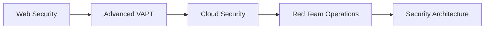

# 🛡️ Het Patel | Cybersecurity Researcher & VAPT Specialist

<div align="center">
  
  <br>
  <em>Securing the digital world, one vulnerability at a time</em>
</div>

---

## 🎯 About Me

```bash
$ whoami
Het Patel
[Cybersecurity Researcher]
[VAPT Specialist] 
[Top 5% TryHackMe]
BTech IT Final Year Student @ BVM Anand
```

I'm a passionate cybersecurity enthusiast and BTech IT final year student from BVM Anand. My journey in cybersecurity has led me through hands-on experiences in vulnerability assessment, penetration testing, and security research.

### 🎯 Current Focus
- **Web Application Security** - Mastering VAPT methodologies
- **Penetration Testing** - Ethical hacking and vulnerability assessment
- **Security Research** - Exploring emerging threats and defense mechanisms

---

## 🏆 Achievements

<div align="center">

| 🥇 **TryHackMe Ranking** | 🛡️ **VAPT Specialist** | 🔬 **Security Researcher** |
|:---:|:---:|:---:|
| **Top 5%** | Real-world Experience | Flutter Development Experience |

</div>

---

## 🛠️ Technical Skills

### 🔐 Cybersecurity
```bash
# Core Competencies
├── Web Application Security
├── Vulnerability Assessment & Penetration Testing (VAPT)
├── Network Security
├── Ethical Hacking
└── Security Research
```

### 💻 Development & Tools
```bash
# Technologies & Tools
├── Flutter Development
├── Security Testing Tools
├── Network Analysis
├── Web Technologies
└── Open Source Contribution
```

---

## 🚀 Featured Projects

### 🏥 Quickmeds - Secure Medicine Delivery Platform


- **Role:** Security Implementation & Development
- **Key Features:** Secure authentication, real-time tracking, vulnerability protection
- **Impact:** Revolutionizing pharmacy delivery with cybersecurity best practices

---

## 📊 GitHub Stats

<div align="center">
  
  
</div>

---

## 🎯 Current Learning Path



---

## 🌐 Connect & Collaborate

<div align="center">

[](https://www.linkedin.com/in/hetpatel9/)
[](https://tryhackme.com/p/hett)
[](https://hettt.medium.com)
[](mailto:awesomehet1@gmail.com)

</div>

---

## 🎮 Fun Facts

- 🕵️‍♂️ I debug systems more than I debug my social life
- 🎯 CTF enthusiast - because real hackers solve puzzles
- ☕ Professional coffee consumer (essential for late-night security research)
- 🚀 Building secure applications that don't break (intentionally)

---

## 📈 Recent Activity

<!--START_SECTION:activity-->
1. 🔒 Conducting VAPT assessments
2. 🛠️ Contributing to open source security tools
3. 📚 Learning advanced penetration testing techniques
4. 🎯 Participating in CTF challenges
<!--END_SECTION:activity-->

---

<div align="center">
  
  
  > *"To err is human, to debug is divine, to secure is my mission."* - Het Patel
  
  
</div>
