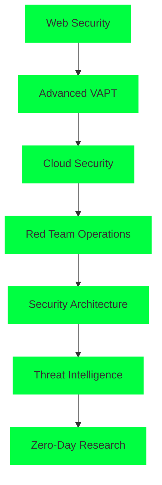

# 🛠️ Skills & Certifications

  

---

## 🔐 Cybersecurity Expertise

### 🛡️ Core Security Skills

| Category | Skills | Proficiency |
|:---:|:---|:---:|
| **Web Security** | OWASP Top 10, SQL Injection, XSS, CSRF, Authentication Bypass | ⭐⭐⭐⭐⭐ |
| **Network Security** | Network Enumeration, Port Scanning, Traffic Analysis, Packet Capture | ⭐⭐⭐⭐⭐ |
| **Mobile Security** | Android Reverse Engineering, APK Analysis, Smali Code Analysis | ⭐⭐⭐⭐ |
| **Penetration Testing** | Vulnerability Assessment, Exploitation, Post-Exploitation | ⭐⭐⭐⭐⭐ |
| **Forensics** | Digital Forensics, Memory Analysis, Network Forensics | ⭐⭐⭐⭐ |

### 🎯 Specialized Areas
- **Web Application Security Testing**
- **API Security Assessment**
- **Social Engineering Techniques**
- **Cryptography & Encryption**
- **Incident Response & Analysis**

---

## 💻 Development & Programming

### 🚀 Programming Languages

### 🛠️ Development Tools & Frameworks

---

## 🔧 Security Tools & Platforms

### 🛡️ Penetration Testing Tools

### 🔍 Analysis & Research Tools

---

## 🏆 Certifications & Achievements

### 📜 Professional Certifications

| Certification | Status | Issuing Organization | Year |
|:---:|:---:|:---:|:---:|
| **TryHackMe Top 5%** | 🟢 Active | TryHackMe | 2024 |
| **Web Application Security** | 🟢 In Progress | OWASP | 2024 |
| **Penetration Testing** | 🟢 In Progress | EC-Council | 2024 |
| **Network Security** | 🟢 Planned | CompTIA | 2024 |

### 🎯 Platform Achievements

| Platform | Achievement | Status |
|:---:|:---|:---:|
| **TryHackMe** | Top 5% Ranking, 100+ Rooms | 🟢 Active |
| **HackTheBox** | Various Challenges Completed | 🟢 Active |
| **VulnHub** | Multiple VMs Pwned | 🟢 Active |
| **CTFTime** | Team Competitions | 🟢 Active |

---

## 📚 Learning Path & Development

### 🎓 Current Learning Focus

### 📖 Skills Development Timeline
| Year | Focus Area | Achievements |
|:---:|:---|:---|
| **2024** | Advanced VAPT, Cloud Security | TryHackMe Top 5%, Advanced Tools |
| **2023** | Web Security, Mobile Security | Flutter Development, Security Analysis |
| **2022** | Basic Security, Programming | Python, JavaScript, Basic Tools |

---

## 🌐 Soft Skills & Professional Development

### 🤝 Communication & Collaboration
- **Technical Documentation** - Writing detailed security reports
- **Presentation Skills** - Explaining complex security concepts
- **Team Collaboration** - Working in security teams and CTF competitions
- **Client Communication** - Explaining security findings to stakeholders

### 🎯 Problem Solving & Analysis
- **Critical Thinking** - Analyzing complex security scenarios
- **Research Skills** - Investigating new vulnerabilities and threats
- **Adaptability** - Learning new tools and techniques quickly
- **Attention to Detail** - Identifying subtle security issues

### 📈 Leadership & Initiative
- **Project Management** - Leading security assessment projects
- **Knowledge Sharing** - Contributing to community and open source
- **Continuous Learning** - Staying updated with latest security trends
- **Innovation** - Developing custom security tools and solutions

---

## 🔬 Research & Specializations

### 📊 Research Areas
- **Emerging Cybersecurity Threats**
- **Mobile Application Security**
- **IoT Security Vulnerabilities**
- **Social Engineering Techniques**
- **Zero-Day Vulnerability Research**

### 🛡️ Specialized Knowledge
- **Android Reverse Engineering**
- **Web Application Security Testing**
- **Network Traffic Analysis**
- **Cryptography & Encryption**
- **Digital Forensics**

---

## 🎮 CTF & Competitive Skills

### 🏆 Competition Categories

| Category | Proficiency | Experience |
|:---:|:---|:---:|
| **Web Exploitation** | ⭐⭐⭐⭐⭐ | Advanced web challenges |
| **Binary Exploitation** | ⭐⭐⭐⭐ | Pwn challenges, buffer overflows |
| **Forensics** | ⭐⭐⭐⭐ | Memory analysis, network forensics |
| **Cryptography** | ⭐⭐⭐⭐ | Crypto challenges, encryption/decryption |
| **Reverse Engineering** | ⭐⭐⭐⭐ | Malware analysis, code reversing |
| **Steganography** | ⭐⭐⭐ | Hidden data extraction |

### 🎯 Problem-Solving Approach
1. **Information Gathering** - Understanding the challenge scope
2. **Tool Selection** - Choosing appropriate tools and techniques
3. **Methodical Analysis** - Systematic approach to problem-solving
4. **Documentation** - Recording findings and methodologies
5. **Knowledge Sharing** - Contributing to community learning

---

  <h3>🚀 Always Learning, Always Growing</h3>
  
Cybersecurity is an ever-evolving field, and I'm committed to continuous improvement!

  
  

